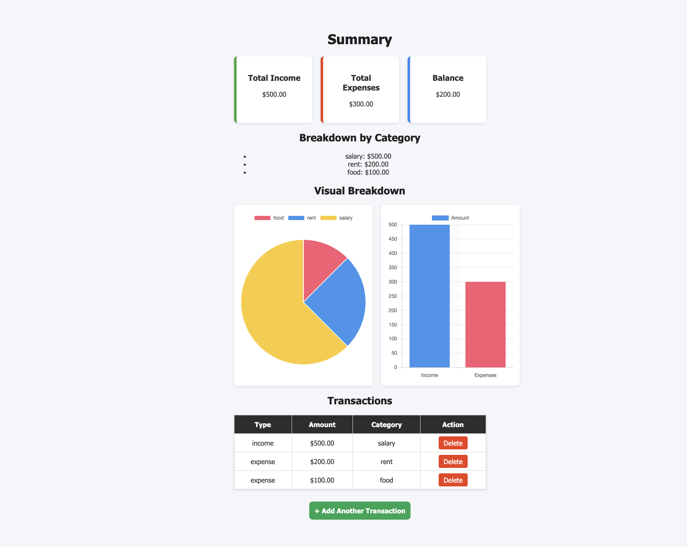

## Personal Finance Tracker

   A simple Python-based finance tool that helps users manage income, expenses, and calculate savings. It provides a breakdown of spending by category and generates insights for better budgeting decisions.

## Features

    Add income and expense transactions with categories

    Store data in MongoDB Atlas

    View totals: Income, Expenses, Balance

    Breakdown by category with Pie Chart

    Income vs Expenses comparison with Bar Chart

    Delete transactions from history

## Tech Stack

    Backend: Flask (Python)

    Database: MongoDB Atlas

    Frontend: HTML, CSS, Chart.js

    Templating: Jinja2

    Styling:CSS

## Screenshots

---

## Setup Instructions
1. Clone the repository
git clone https://github.com/NawidH05/financial-tracker.git
cd financial-tracker

2. Install dependencies
pip install -r requirements.txt

3. Set up environment variables

Create a .env file in the root folder and add your MongoDB connection string:

MONGO_URI=your-mongodb-connection-string

4. Run the app
python app.py

Go to http://127.0.0.1:5000/ in your browser.

## Project Structure
personal-finance-app/
│── static/             # CSS, JS, images  
│── templates/          # HTML templates (index, summary)  
│── app.py              # Flask app  
│── requirements.txt    # Dependencies  
│── README.md           # Documentation  
│── .env                # MongoDB URI (ignored by Git)  
│── .gitignore          # Ignore cache + sensitive files 

## Key Takeaways
This project strengthened my understanding of:
- Full-stack development with Flask and MongoDB
- Data visualization using Chart.js
- Managing CRUD operations and backend integration
